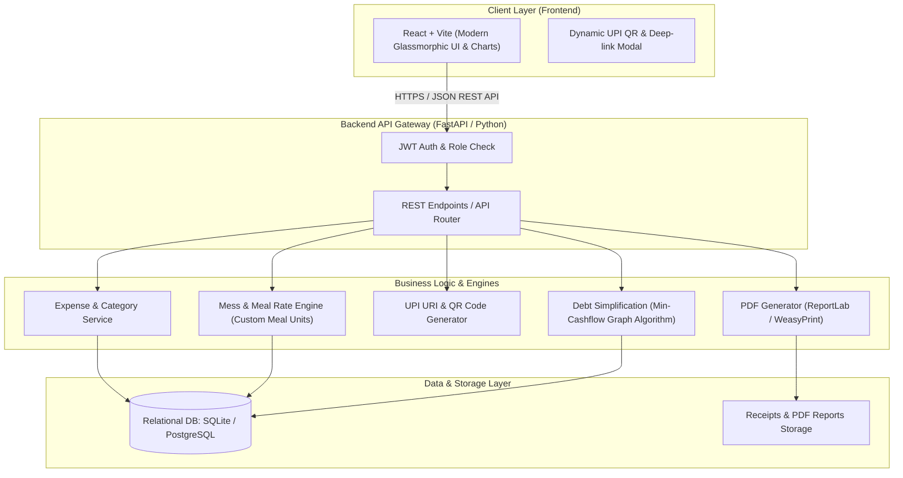
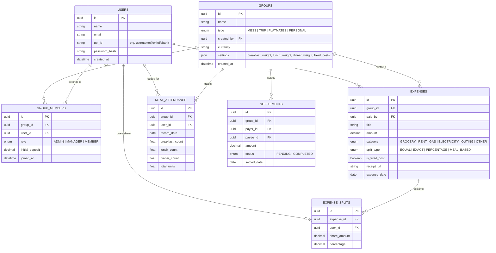

# 🏨 Universal Expense & Mess Management Web Application
> **Comprehensive System Architecture & Implementation Blueprint**

---

## 📌 Executive Summary & Problem Statement

### The Problem
During 3+ years of hostel/mess life or group living (flatmates, trips, family outings), tracking and calculating monthly or shared expenses manually leads to:
1. **Mess/Hostel Calculation Complexity**: Handling varying meal counts (breakfast/lunch/dinner), individual deposits, and shared fixed costs (cook salary, gas, electricity, rent) vs variable grocery expenses.
2. **Disputes & Calculation Errors**: Complex debt chains where $A \rightarrow B \rightarrow C$, causing confusion on who owes how much to whom.
3. **Lack of Transparency**: Receipts getting lost, lack of real-time visibility, and delayed end-of-month reconciliation.
4. **Manual Ledger/Console Limitations**: Difficult to share, lacks mobile/web access, and missing instant visual breakdowns and professional downloadable PDF statements.

### The Solution
A modern, scalable **Universal Expense & Mess Management Platform** that supports:
- **Mess & Hostel Mode**: Daily meal attendance tracking with customizable meal units (e.g. Breakfast = 0.5, Lunch = 1, Dinner = 1), dynamic meal rate calculation, manager rotation, deposit tracking, and monthly summary balance sheets.
- **Trip / Tour Mode**: Instant multi-currency/multi-person expense splitting with uneven shares, percentages, or exact amounts.
- **Flatmate / Shared Living Mode**: Recurring utility bills (Wi-Fi, Maid, Electricity, Groceries) with automated debt simplification algorithm (Cashflow Minimization).
- **Instant UPI Settle-up**: Dynamic UPI QR codes and deep links (`upi://pay?pa=...&pn=...&am=...`) for one-tap payments on Google Pay, PhonePe, and Paytm.
- **Automated PDF Statements**: Detailed monthly audit reports with tables, category charts, and settlement breakdowns.

---

## 🏛️ System Architecture



---

## 🧮 Core Algorithms & Calculation Engines

### 1. Mess / Hostel Monthly Calculation Engine
In a typical mess system with customizable weights ($W_{\text{breakfast}}=0.5, W_{\text{lunch}}=1.0, W_{\text{dinner}}=1.0$):
$$\text{Individual Meals} = \sum_{\text{days}} (B \times W_B + L \times W_L + D \times W_D)$$
$$\text{Total Meals Consumed} = \sum_{\text{all members}} \text{Individual Meals}$$
$$\text{Meal Rate} = \frac{\text{Total Variable Grocery Expense}}{\text{Total Meals Consumed}}$$

$$\text{Individual Due} = (\text{Individual Meals} \times \text{Meal Rate}) + \frac{\text{Fixed Shared Expenses}}{\text{Total Members}}$$
$$\text{Final Balance (Refund / Due)} = \text{Individual Deposit} - \text{Individual Due}$$

### 2. Debt Simplification (Minimum Cash Flow Graph Algorithm)
Computes net balance for each person ($Balance = TotalPaid - TotalOwed$) and simplifies transactions down to at most $N-1$ using a Greedy Two-Pointer Heap.

### 3. Dynamic UPI String & QR Generation
$$\text{URI} = \texttt{upi://pay?pa=}\langle\text{payee\_upi\_id}\rangle\texttt{\&pn=}\langle\text{payee\_name}\rangle\texttt{\&am=}\langle\text{amount}\rangle\texttt{\&cu=INR\&tn=Mess\_Settlement}$$

---

## 🗄️ Database Schema Design (Entity Relationship)



---

## 🛠️ Chosen Technology Stack

| Layer | Technology | Rationale |
| :--- | :--- | :--- |
| **Backend** | **Python (FastAPI)** | Blazing fast ASGI performance, native asynchronous support, auto-generated OpenAPI docs at `/docs`. |
| **Database** | **SQLAlchemy 2.0 + SQLite / PostgreSQL** | Full transactional integrity, high-precision numeric calculations. |
| **Frontend** | **React (Vite) + Tailwind & Glassmorphic CSS** | Ultra-responsive, interactive meal matrix grid, dynamic balance graph animations, and offline-friendly. |
| **PDF Generation** | **ReportLab / WeasyPrint** | Structured table formatting and clean printable PDF balance sheets. |
| **Payment Integration** | **Dynamic UPI Deep-link & QR Code** | Seamless settlement directly through PhonePe, Google Pay, and Paytm. |

---

## ⚙️ What You Need To Do Manually (Checklist & Guide)

### 1. 🐙 Git Repository Setup (One-time)
When you want to turn this project into a Git repository and push to GitHub:
```powershell
# Inside the HostelExpenseManager directory:
git init
git add .
git commit -m "Initial commit: Universal Hostel and Expense Manager"

# Create a repo on github.com, then connect:
git remote add origin https://github.com/YOUR_GITHUB_USERNAME/HostelExpenseManager.git
git branch -M main
git push -u origin main
```

### 2. 🔑 Environment Variables (`.env`)
Create a `.env` file in the backend directory (a `.env.example` template will be provided):
```env
SECRET_KEY=your-super-secret-random-key-here-change-in-production
ALGORITHM=HS256
ACCESS_TOKEN_EXPIRE_MINUTES=10080
DATABASE_URL=sqlite:///./hostel_expense.db
ENVIRONMENT=development
FRONTEND_URL=http://localhost:5173
```

### 3. 🚀 Local Running (When developing)
- **Backend**:
  ```powershell
  cd backend
  python -m venv .venv
  .venv\Scripts\activate
  pip install -r requirements.txt
  uvicorn app.main:app --reload --port 8000
  ```
- **Frontend**:
  ```powershell
  cd frontend
  npm install
  npm run dev
  ```

### 4. 🌐 Cloud Deployment (When launching live online - 100% Free Tiers)
1. **Backend & Database**: Deploy on **Render.com** or **Railway.app** (Free Python Web Service + Free PostgreSQL).
   - Set environment variables in Render/Railway dashboard (`SECRET_KEY`, `DATABASE_URL`, `FRONTEND_URL`).
2. **Frontend**: Deploy on **Vercel** or **Netlify** (Connect your GitHub repo, set build command `npm run build`, and add backend API URL in environment variables).
